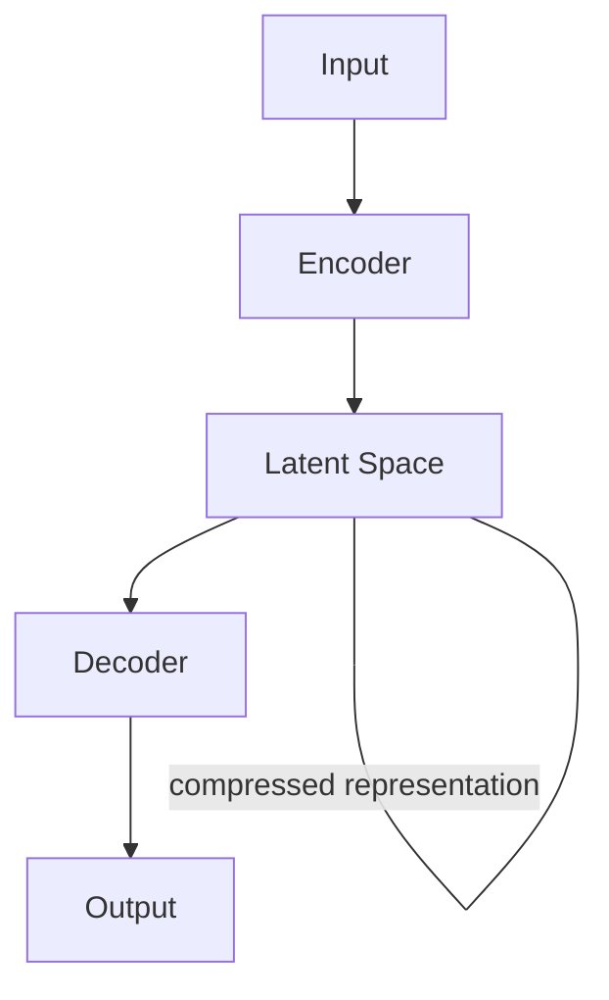

### **What is an Autoencoder?**
An **autoencoder** is a type of artificial neural network used to learn efficient representations of data, typically for dimensionality reduction or unsupervised learning. It is designed to reconstruct its input, meaning the output of the network should be as close as possible to the input.

---

### **Architecture of Autoencoder**
An autoencoder has two main components:

1. **Encoder**:
   - Maps the input data to a lower-dimensional space (latent space).
   - This is the process of feature extraction or dimensionality reduction.
   - Example: Input data of size $784$ (e.g., flattened 28x28 MNIST images) might be reduced to a latent space of size $32$.

2. **Decoder**:
   - Reconstructs the input data from the latent space representation.
   - This is the process of mapping back to the original input dimension.

### Typical Autoencoder Architecture:

---

### **Mathematical Representation**
1. Let the input be $x$.
2. The **encoder** maps $x$ to a latent space representation $z$:
   $$z = f_\text{encoder}(x)$$
   - $z$ is the compressed (latent) representation.

3. The **decoder** reconstructs $x'$ (the approximation of the original input):
   $$
   x' = f_\text{decoder}(z)
   $$

   4. The objective is to minimize the reconstruction error, typically measured using Mean Squared Error (MSE) or other loss functions:
$$
\mathcal{L} = \sum_{i = 0}^{n} ||Dec_{\phi}(Enc_{\theta}(x))-x||^2 + regularization
$$

---

### **Key Properties**
- **Unsupervised Learning** or Semi-Supervised Learning:
  - Autoencoders do not require labeled data since the input itself acts as the target output.

- **Dimensionality Reduction**:
  - The latent space ($z$) serves as a compressed, meaningful representation of the input.

---

### **Types of Autoencoders**
1. **Vanilla Autoencoder**:
   - Basic architecture with one encoder and one decoder.

2. **Sparse Autoencoder**:
   - Enforces sparsity on the latent representation $z$, encouraging the network to learn meaningful features (e.g., only a few neurons in $z$ are active).

3. **Denoising Autoencoder**:
   - Takes a corrupted version of the input as input and learns to reconstruct the clean version, making it robust to noise.
   - ![[Pasted image 20241123214343.png]]

4. **Variational Autoencoder (VAE)**:
 
 
   - Learns a probabilistic latent space, enabling generation of new samples similar to the training data.
   - Latent variables are sampled from a distribution (e.g., Gaussian).
### KL Divergence Calculation
![[Pasted image 20241123230330.png]]

6. **Convolutional Autoencoder**:
   - Uses convolutional layers, typically for image data, to capture spatial features.

7. **Undercomplete and Overcomplete Autoencoders**:
   - **Undercomplete**: Latent space dimension ($z$) is smaller than input dimension ($x$), enforcing a bottleneck to extract key features.
   - **Overcomplete**: Latent space dimension is larger than the input, often regularized to prevent the network from simply memorizing the input.

---

### **Applications of Autoencoders**
1. **Dimensionality Reduction**:
   - Alternative to Principal Component Analysis (PCA), especially for non-linear data.
   
2. **Anomaly Detection**:
   - Detect anomalies by measuring reconstruction error (e.g., fraudulent transactions, defective products).
   - Anomalous data will typically have a higher reconstruction error since it deviates from the training data.

3. **Image Denoising**:
   - Removes noise from images by training on clean and noisy image pairs.

4. **Data Compression**:
   - Compresses large datasets by storing only the latent representation.

5. **Generative Models**:
   - Variational Autoencoders (VAEs) generate new data points (e.g., new images similar to training data).

6. **Recommendation Systems**:
   - Encodes user preferences in latent space to make recommendations.

7. **Pretraining for Deep Networks**:
   - Pretrained layers of an autoencoder can be used to initialize deep neural networks.

---

### **Strengths of Autoencoders**
1. **Unsupervised Learning**:
   - Can work without labels, making them versatile for various datasets.
   
2. **Non-linear Transformations**:
   - Capture complex relationships in data better than linear methods like PCA.

3. **Customizable Architecture**:
   - Tailored for specific use cases (e.g., convolutional layers for images).

---

### **Limitations of Autoencoders**
1. **Poor Generalization**:
   - Autoencoders might not generalize well to unseen data, especially if the latent space is not well-regularized.

2. **Training Challenges**:
   - Deep autoencoders can suffer from vanishing gradients or overfitting.

3. **Data Dependency**:
   - Performance depends heavily on the quality and variety of training data.

---

### **Example of Autoencoder Workflow**
#### Training:
- Train the autoencoder on a dataset of images to minimize reconstruction error.

#### Testing:
- Input a test image and compare the reconstructed output to the original.

#### Output:
- If the reconstruction closely resembles the input, the autoencoder has learned the key features of the data.

---

Autoencoders are a foundation for advanced architectures like VAEs, GANs, and self-supervised learning methods, and they remain crucial in understanding representation learning.
