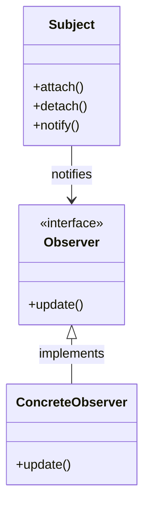

**Observer** is a behavioral design pattern that lets you define a subscription mechanism to notify multiple objects about any events that happen to the object they’re observing.
![[Pasted image 20241214134757.png]]

## Overview

- **Purpose**: Establish a one-to-many dependency between objects so that when one object (subject) changes state, all its dependents (observers) are notified and updated automatically.
- **Type**: [[Behavioral Patterns]].

---

## Key Concepts

- **Subject**:
    - Maintains a list of observers.
    - Notifies observers of state changes.
- **Observer**:
    - Defines an interface to be updated by the subject.
    - Reacts to state changes in the subject.

---

## Structure

1. **Subject Interface**:
    
    - Methods to:
        - Attach observers.
        - Detach observers.
        - Notify all observers.
2. **Concrete Subject**:
    
    - Implements the subject interface.
    - Maintains state and notifies observers when it changes.
3. **Observer Interface**:
    
    - Defines the `update()` method that concrete observers implement.
4. **Concrete Observer**:
    
    - Implements the observer interface.
    - Updates its state based on the subject’s notifications.

---

## UML Diagram (Optional)




---

## Example Code (Pseudocode)

```java
// Subject Interface
interface Subject {
    void attach(Observer o);
    void detach(Observer o);
    void notifyObservers();
}

// Concrete Subject
class ConcreteSubject implements Subject {
    private List<Observer> observers = new ArrayList<>();
    private String state;

    void setState(String state) {
        this.state = state;
        notifyObservers();
    }

    String getState() {
        return state;
    }

    public void attach(Observer o) {
        observers.add(o);
    }

    public void detach(Observer o) {
        observers.remove(o);
    }

    public void notifyObservers() {
        for (Observer o : observers) {
            o.update(state);
        }
    }
}

// Observer Interface
interface Observer {
    void update(String state);
}

// Concrete Observer
class ConcreteObserver implements Observer {
    private String observerState;

    public void update(String state) {
        this.observerState = state;
        System.out.println("Observer state updated to: " + state);
    }
}
```

---

## Use Cases

- **Event handling**: GUI frameworks (button clicks, input field updates).
- **Messaging systems**: Pub-Sub models (e.g., message brokers).
- **Real-time systems**: Stock tickers, live sports updates.

---

## Advantages

1. Decouples subject and observers.
2. Follows the **Open/Closed Principle**: Can add new observers without modifying the subject.

---

## Disadvantages

1. Can cause performance issues with a large number of observers.
2. Observers are not guaranteed to be notified in a specific order.
3. Can result in **cascading updates** when multiple subjects and observers depend on each other.

---

## Notes

- **Push vs. Pull**:
    - Push: Subject sends state directly to observers.
    - Pull: Observer fetches the state from the subject.
- Consider **weak references** for observers to prevent memory leaks.

---
